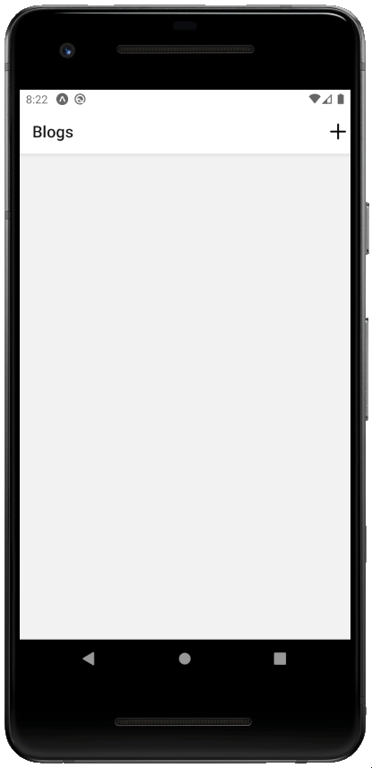

<div align="center">

<!-- 


[](https://github.com/blackphoenix42/blog-post-app/blob/master/LICENSE) -->


<h3>Blog Post App</h3>
<h4>Join official <a href="https://discord.gg/mRUZEhD">Discord Server</a> for discussion.</h4>


</div>

# About

An app where a user can create, read, update and delete blog post.

<div align="center">
	
</div>

# 🌱 Quick Start

- Star🌟 and Fork this repository

- Clone this repository remotely.

```sh
git clone https://github.com/blackphoenix42/blog-post-app.git
```

# Setup

- First, navigate to `./Backend` directory to start the server.

- Install the dependencies

```sh
npm install
```

- Run `json-server` using:

```sh
npm run db
```

- Open another terminal to run `ngrok`:

```sh
npm run tunnel
```

- Copy the URL from of `Forwarding` from the `ngrok` terminal. Example URL: `http://a9afa77f5518.ngrok.io/`

- Now navigate to `./src/api` directory and open `jsonserver.js` file.
- Replace the `baseURL` with the one you copied from ngrok terminal.

- Come back to root directory and install the dependencies

```sh
npm install
```

- Start the app

```sh
npm start
```

- Scan the QR Code to run the app in your phone using `expo` application.

<div align="center">
	
</div>

## 🚀 How to Contribute to Project?

- Take a look at the Existing [Issues](https://github.com/blackphoenix42/blog-post-app/issues) or create your own Issues!
- Check out [CONTRIBUTING.md](./CONTRIBUTING.md)

<div align="center">
	
</div>

## 👾 Project Admin

<table>
	<tr>
		<td align="center">
			<a href="https://github.com/blackphoenix42">
				
				<br /> <sub><b>blackphoenix42</b></sub>
			</a>
			<br /> <a href="https://github.com/blackphoenix42">
		👑 Admin
	    </a>
		</td>
	</tr>
</table>

<!-- ## 🌟 Contributors

<table>
	<tr>
		<td>
			contrib.rocks
			</a>
		</td>
	</tr>
</table> -->
